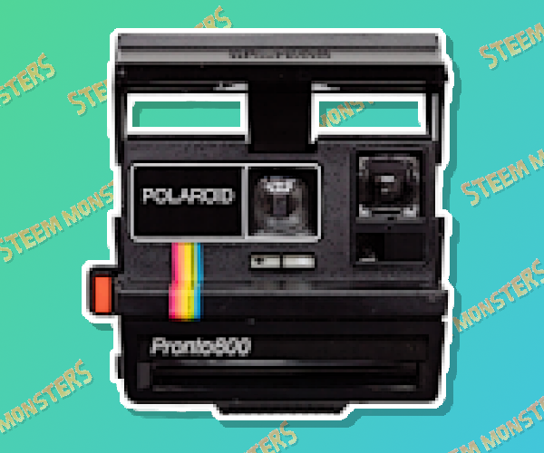

# Steem-Monsters-Snap
a casual picture taking game for the Steem Monsters game jam

###

###

# How To Run This Project

### First, you'll need Superpowers
**not that kinda superpowers**

* Get & install the Superpowers HTML5 game engine from here: http://superpowers-html5.com/
* Download this repo as a `.zip`
* Find your Superpowers **projects** folder [ *for more information on where to find this, read the **Where's My Data Stored?** section here: http://docs.superpowers-html5.com/en/getting-started/setting-up-superpowers* ]
* Start up your Superpowers game engine & server
* Open this project within your game engine
* Bam, Boom, Zoom, you now have access to my bad code

### Need / Want More Info On How To Run / Use Superpowers?
#### read this, it'll help ya out: http://docs.superpowers-html5.com/en/getting-started/about-superpowers
